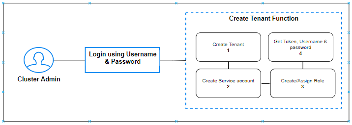
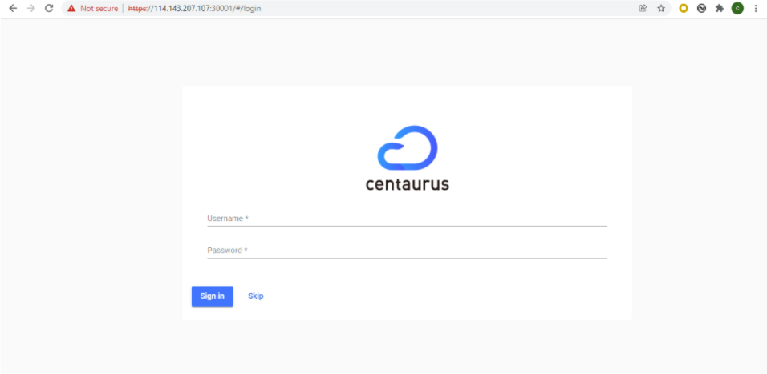
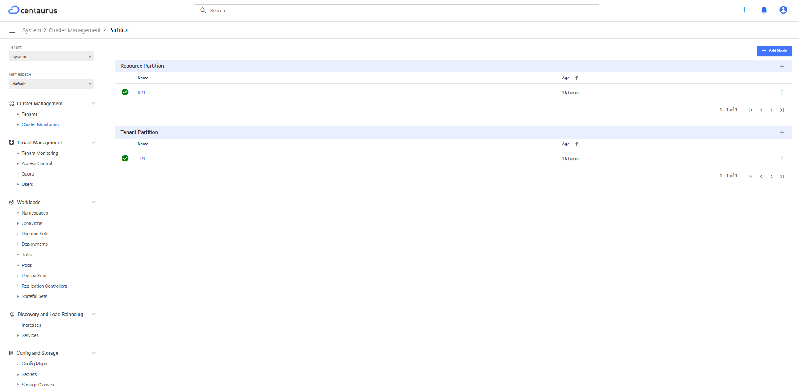
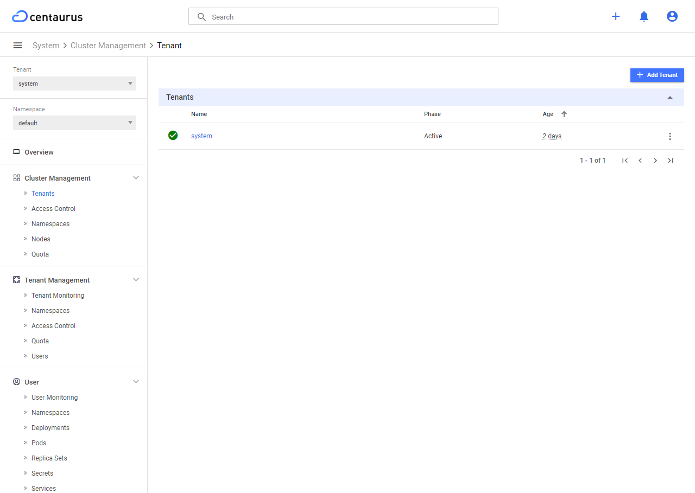
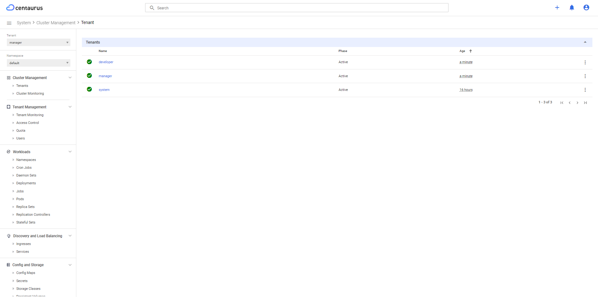
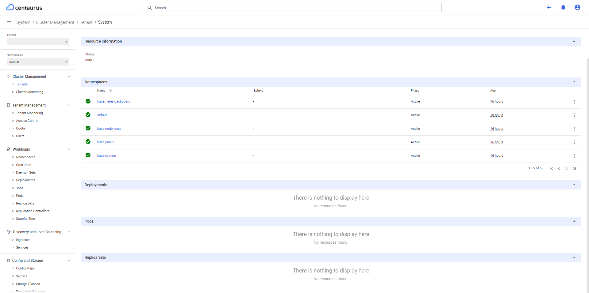
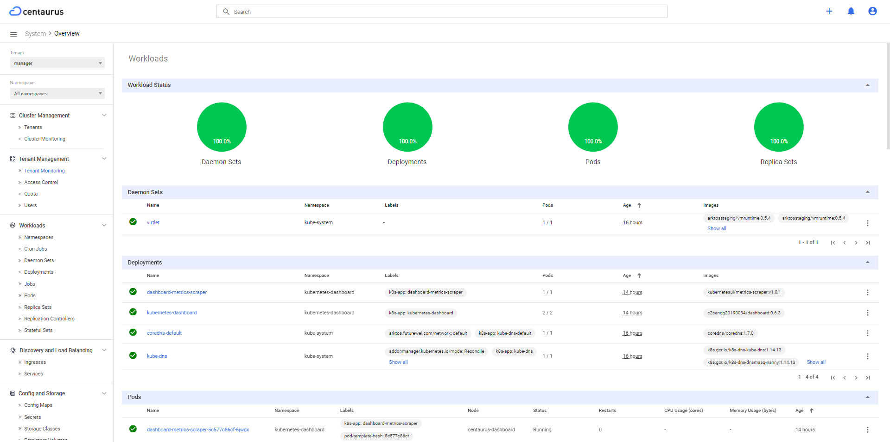
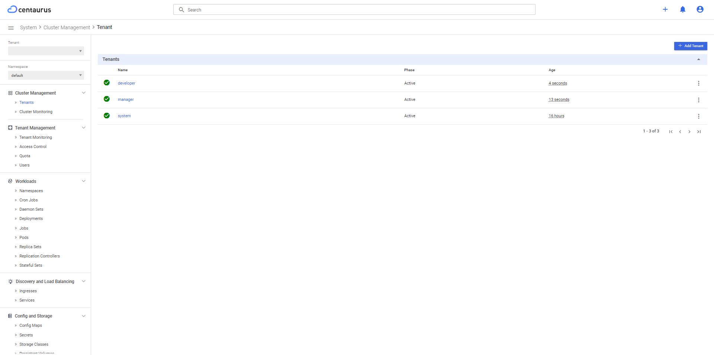
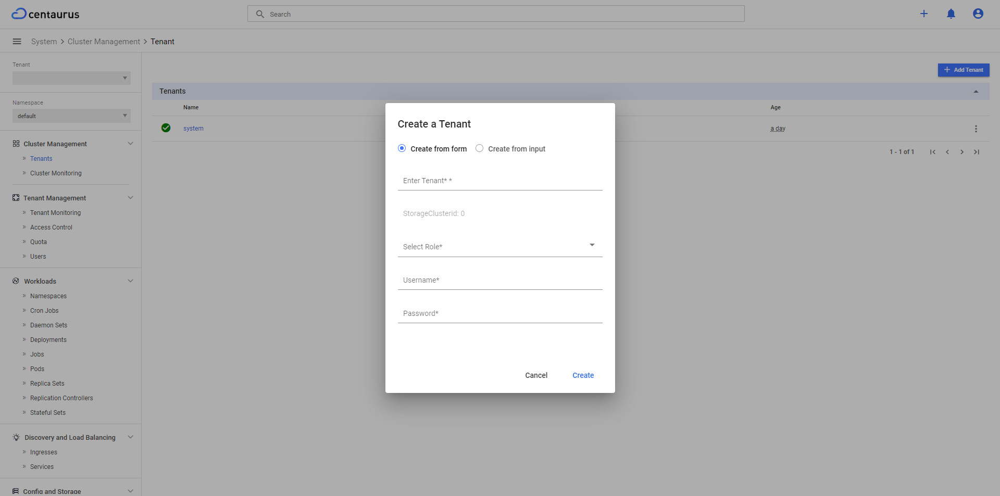
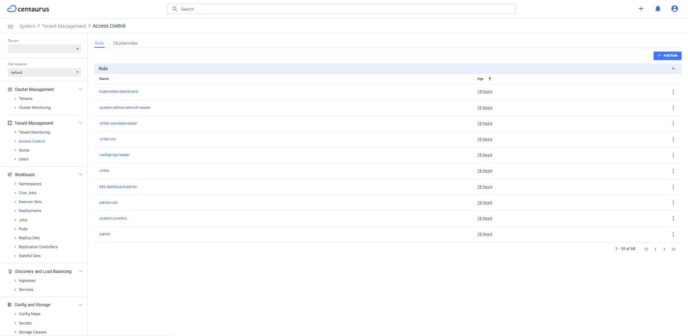

# Centaurus Portal
This design document is a proposal for enhancing the dashboard UI that
allows users to manage Centaurus Cluster, Tenants, Users, and
Quotas in an intuitive way.

## Goals
To add following features in the Centaurus Portal(Dashboard UI)
* Manage Centaurus Cluster
* Enable user to login using username and password (instead of token)
* Tenant management
* User management
* Monitoring
* Managing Quotas and namespaces

### Non-goals
TBA

## Background
Cluster admin can perform following operation using CLI (i.e. using `kubectl` utility)
* Tenant Operation (Create, List and Delete)
* Create RBAC roles and role bindings for other fine-grained cluster admins

Currently, CLI does not support following features:
* Managing Quotas for tenants
* User Management

None of these are reflected in the current version of Dashboard UI. There should be a simplified,
more user-friendly way to manage the cluster, tenants and users.

### Assumptions and Constraints
TBA

## Overview
### User Management

### Cluster admin profile
Cluster admin can perform following operation using Dashboard UI:
* Create Tenant
* Delete Tenant
* List Tenant
* Monitor health checks & resource utilization for each and every partition
* Reconfigure Cluster Partitions
* Create RBAC roles and role bindings for other fine-grained cluster admins

### Tenant admin profile
Tenant admin can perform following operation using Dashboard UI:
* Creating other fine-grained tenant admins and regular tenant users
* Monitor health checks & resource utilization for its own respective tenant within the Centaurus cluster
* List/create/delete users
* Create RBAC roles and role bindings in the tenant
* Manage namespace quotas for a tenant

### Tenant user profile
Tenaent user can perform following operation using Dashboard UI:
* Application deployment
* Monitoring and resource utilization according to RBAC

## Feature details
___
#### 1. IAM service details
IAM service is a service that manages users, roles, and permissions.
This service will be used to manage Centaurus user's username and password.
#### 2. Create Tenant Operation

At the time of a tenant creation by *Cluster admin*, a default tenant admin user will be created inside the newly created tenant. Once done, the default tenant admin can do everything inside the tenant without turning to cluster admin for any tenant management functions. 

###### API Used
* Create Tenant
* Create Roles and Rolebinding

###### Work Flow

#### 3. Create Tenant User Operation
Step 1: Create a tenant

Step 2: Create a Role, Service account and Rolebinding

Step 3: Get token for the user (later it will be mapped with username password)

#### 4. Resource Monitoring
* Cluster admin can monitor health checks & resource utilization for each and every partition
* Tenant admin can monitor health checks & resource utilization for its own respective tenant within the Centaurus cluster
* Tenant user can monitor health checks & resource utilization according to RBAC

###### API to be developed in Dashboard backend
* Create Tenant
* Delete Tenant
* Create Cluster Roles
* Create Roles
* Create Rolebinding
* Create namespace for specific tenant
* Delete namespace for specific tenant
* Create Service Account
* Create Node

### Detailed Design

##### 1. Login Page

##### 2. Cluster Monitoring
* List of all the partitions available

* It will show details of all nodes and resources

* It will show details of all tenants

  
##### 3. Tenant Monitoring
* It will show details of all resources within a tenant

##### 4. Tenant Operation
***List Tenants***

***Create Tenant***

***Delete Tenant***

##### 5. Access Control
***Roles and Cluster roles***

##### 6. Managing Quotas and namespaces
* It will show quotas for a tenant
* Cluster admin can assign quota to a tenant
* Cluster admin can update the quota assigned to a tenant

### Developement Portal Link

***Link***: [Centaurus Portal](https://35.209.119.154:9445/#/login)

***Username***: `admin`

***Password***: `password` 
