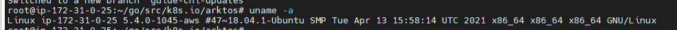
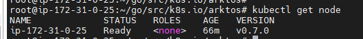
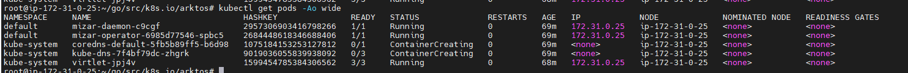
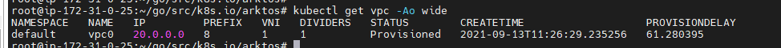
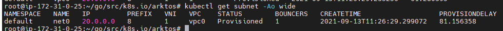
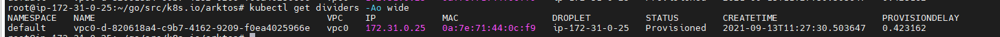
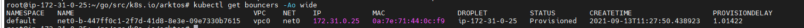
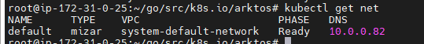

# Test report for deploying Arktos cluster with Mizar CNI

This document captures the steps to deploy an Arktos cluster lab with mizar cni. The machines in this lab used are AWS EC2 t2-xlarge (4 CPUs, 16GB mem), Ubuntu 18.04 LTS.

### Step-1: Create an instance on AWS
Created instance on AWS


### Step-2: Install dependencies
Login to created instance and run following steps to install dependencies required for arktos deployment:

```bash
wget https://raw.githubusercontent.com/CentaurusInfra/arktos/master/hack/setup-dev-node.sh
sudo bash setup-dev-node.sh
git clone https://github.com/CentaurusInfra/arktos.git ~/go/src/k8s.io/arktos
echo export PATH=$PATH:/usr/local/go/bin\ >> ~/.profile
echo cd \$HOME/go/src/k8s.io/arktos >> ~/.profile
source ~/.profile
```

### Step-3: Update kernel (If required)

* To check kernel, run following command

```bash
uname -a
```
##### Output


Here kernel version was `5.4.0-1045-aws` which is less than the required kernel version, so to update the kernel version to `5.6.0-rc2`, we used the following steps :

```bash
wget https://raw.githubusercontent.com/CentaurusInfra/mizar/dev-next/kernelupdate.sh
sudo bash kernelupdate.sh
```

##### Output
```
root@ip-172-31-0-25:~/go/src/k8s.io/arktos# sudo bash kernelupdate.sh
--2021-09-13 11:07:51--  https://mizar.s3.amazonaws.com/linux-5.6-rc2/linux-headers-5.6.0-rc2_5.6.0-rc2-1_amd64.deb
Resolving mizar.s3.amazonaws.com (mizar.s3.amazonaws.com)... 3.5.11.107
Connecting to mizar.s3.amazonaws.com (mizar.s3.amazonaws.com)|3.5.11.107|:443... connected.
HTTP request sent, awaiting response... 200 OK
Length: 7621020 (7.3M) []
Saving to: ‘../linux-5.6-rc2/linux-headers-5.6.0-rc2_5.6.0-rc2-1_amd64.deb’

linux-headers-5.6.0-rc2_5.6.0-rc2-1_amd64.deb       100%[=================================================================================================================>]   7.27M  8.18MB/s    in 0.9s

2021-09-13 11:07:52 (8.18 MB/s) - ‘../linux-5.6-rc2/linux-headers-5.6.0-rc2_5.6.0-rc2-1_amd64.deb’ saved [7621020/7621020]

--2021-09-13 11:07:52--  https://mizar.s3.amazonaws.com/linux-5.6-rc2/linux-image-5.6.0-rc2-dbg_5.6.0-rc2-1_amd64.deb
Resolving mizar.s3.amazonaws.com (mizar.s3.amazonaws.com)... 52.216.154.220
Connecting to mizar.s3.amazonaws.com (mizar.s3.amazonaws.com)|52.216.154.220|:443... connected.
HTTP request sent, awaiting response... 200 OK
Length: 857827912 (818M) [application/x-www-form-urlencoded]
Saving to: ‘../linux-5.6-rc2/linux-image-5.6.0-rc2-dbg_5.6.0-rc2-1_amd64.deb’

linux-image-5.6.0-rc2-dbg_5.6.0-rc2-1_amd64.deb     100%[=================================================================================================================>] 818.09M  15.2MB/s    in 48s

2021-09-13 11:08:40 (17.0 MB/s) - ‘../linux-5.6-rc2/linux-image-5.6.0-rc2-dbg_5.6.0-rc2-1_amd64.deb’ saved [857827912/857827912]

--2021-09-13 11:08:40--  https://mizar.s3.amazonaws.com/linux-5.6-rc2/linux-image-5.6.0-rc2_5.6.0-rc2-1_amd64.deb
Resolving mizar.s3.amazonaws.com (mizar.s3.amazonaws.com)... 52.216.65.48
Connecting to mizar.s3.amazonaws.com (mizar.s3.amazonaws.com)|52.216.65.48|:443... connected.
HTTP request sent, awaiting response... 200 OK
Length: 56427036 (54M) [application/x-www-form-urlencoded]
Saving to: ‘../linux-5.6-rc2/linux-image-5.6.0-rc2_5.6.0-rc2-1_amd64.deb’

linux-image-5.6.0-rc2_5.6.0-rc2-1_amd64.deb         100%[=================================================================================================================>]  53.81M  7.32MB/s    in 7.9s

2021-09-13 11:08:49 (6.77 MB/s) - ‘../linux-5.6-rc2/linux-image-5.6.0-rc2_5.6.0-rc2-1_amd64.deb’ saved [56427036/56427036]

--2021-09-13 11:08:49--  https://mizar.s3.amazonaws.com/linux-5.6-rc2/linux-libc-dev_5.6.0-rc2-1_amd64.deb
Resolving mizar.s3.amazonaws.com (mizar.s3.amazonaws.com)... 52.216.112.156
Connecting to mizar.s3.amazonaws.com (mizar.s3.amazonaws.com)|52.216.112.156|:443... connected.
HTTP request sent, awaiting response... 200 OK
Length: 1082248 (1.0M) []
Saving to: ‘../linux-5.6-rc2/linux-libc-dev_5.6.0-rc2-1_amd64.deb’

linux-libc-dev_5.6.0-rc2-1_amd64.deb                100%[=================================================================================================================>]   1.03M  1.86MB/s    in 0.6s

2021-09-13 11:08:50 (1.86 MB/s) - ‘../linux-5.6-rc2/linux-libc-dev_5.6.0-rc2-1_amd64.deb’ saved [1082248/1082248]

Continue kernel update (y/n)?y
Updating kernel
Selecting previously unselected package linux-headers-5.6.0-rc2.
(Reading database ... 61777 files and directories currently installed.)
Preparing to unpack .../linux-headers-5.6.0-rc2_5.6.0-rc2-1_amd64.deb ...
Unpacking linux-headers-5.6.0-rc2 (5.6.0-rc2-1) ...
Selecting previously unselected package linux-image-5.6.0-rc2-dbg.
Preparing to unpack .../linux-image-5.6.0-rc2-dbg_5.6.0-rc2-1_amd64.deb ...
Unpacking linux-image-5.6.0-rc2-dbg (5.6.0-rc2-1) ...
Selecting previously unselected package linux-image-5.6.0-rc2.
Preparing to unpack .../linux-image-5.6.0-rc2_5.6.0-rc2-1_amd64.deb ...
Unpacking linux-image-5.6.0-rc2 (5.6.0-rc2-1) ...
Preparing to unpack .../linux-libc-dev_5.6.0-rc2-1_amd64.deb ...
Unpacking linux-libc-dev:amd64 (5.6.0-rc2-1) over (4.15.0-156.163) ...
Setting up linux-headers-5.6.0-rc2 (5.6.0-rc2-1) ...
Setting up linux-image-5.6.0-rc2-dbg (5.6.0-rc2-1) ...
Setting up linux-image-5.6.0-rc2 (5.6.0-rc2-1) ...
update-initramfs: Generating /boot/initrd.img-5.6.0-rc2
Sourcing file `/etc/default/grub'
Sourcing file `/etc/default/grub.d/50-cloudimg-settings.cfg'
Generating grub configuration file ...
Found linux image: /boot/vmlinuz-5.6.0-rc2
Found initrd image: /boot/initrd.img-5.6.0-rc2
Found linux image: /boot/vmlinuz-5.4.0-1045-aws
Found initrd image: /boot/initrd.img-5.4.0-1045-aws
done
Setting up linux-libc-dev:amd64 (5.6.0-rc2-1) ...
Reboot host (y/n)?y
Rebooting

```

### Step-4: Start Arktos cluster
*Login to instance  and run following steps to deploy arktos cluster with Mizar as CNI*
```bash
cd $HOME/go/src/k8s.io/arktos
CNIPLUGIN=mizar ./hack/arktos-up.sh
```
**Finally we got  following output, which indicates that arktos cluster created successfully with Mizar as CNI**

```bigquery
*******************************************
Local Kubernetes cluster is running. Press Ctrl-C to shut it down.

Logs:
  /tmp/kube-apiserver0.log
  /tmp/kube-controller-manager.log


  /tmp/kube-proxy.log
  /tmp/kube-scheduler.log
  /tmp/kubelet.log

To start using your cluster, you can open up another terminal/tab and run:

  export KUBECONFIG=/var/run/kubernetes/admin.kubeconfig
Or
  export KUBECONFIG=/var/run/kubernetes/adminN(N=0,1,...).kubeconfig

  cluster/kubectl.sh

Alternatively, you can write to the default kubeconfig:

  export KUBERNETES_PROVIDER=local

  cluster/kubectl.sh config set-cluster local --server=https://ip-172-31-0-25:6443 --certificate-authority=/var/run/kubernetes/server-ca.crt
  cluster/kubectl.sh config set-credentials myself --client-key=/var/run/kubernetes/client-admin.key --client-certificate=/var/run/kubernetes/client-admin.crt
  cluster/kubectl.sh config set-context local --cluster=local --user=myself
  cluster/kubectl.sh config use-context local
  cluster/kubectl.sh
```
##### *Leave this terminal here as it is (do not close the terminal) and open new terminal of same instance*

### Step-5 Check Cluster health
Open new terminal for same instance and run following commands:

##### Check node status
```bigquery
kubectl get node
```
***Output***



##### Check pods status
```bigquery
kubectl get pods -Ao wide
```
***Output***



##### Check vpcs
```bigquery
kubectl get vpc -Ao wide
```
***Output***



##### Check subnets
```bigquery
kubectl get subnet -Ao wide
```
***Output***



##### Check dividers
```bigquery
kubectl get dividers -Ao wide
```
***Output***



##### Check bouncers
```bigquery
kubectl get bouncers -Ao wide
```
***Output***



##### Check networks
```bigquery
kubectl get net
```
***Output***



Now default network of system tenant is ready


##### Pod deployment
*Pods are getting stuck in ContainerCreating state, found issue of `loopback` binary for which team is going to generate another PR.*
